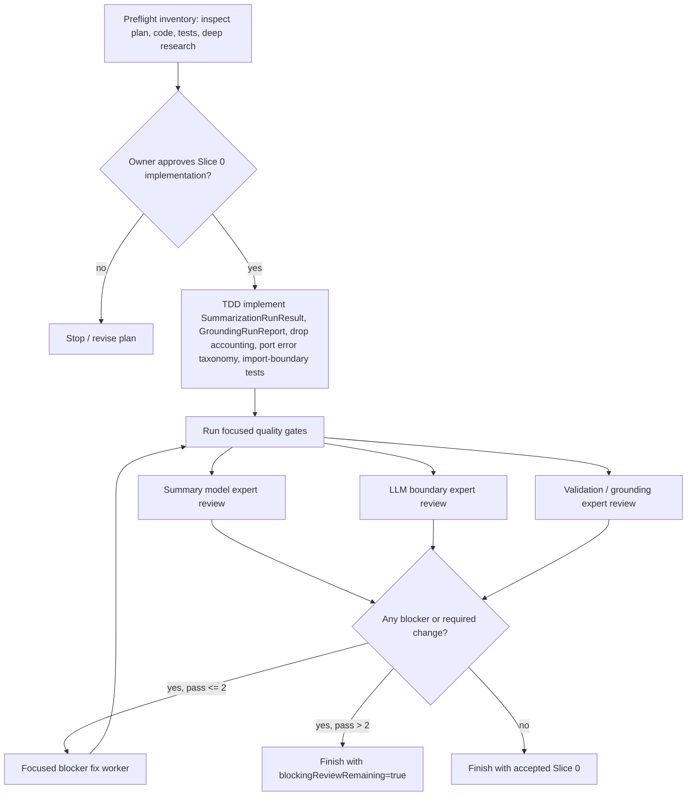

# Summary-agent Slice 0 observability + boundary process

```mermaid
flowchart TD
  A[Preflight inventory: inspect plan, code, tests, deep research] --> B{Owner approves Slice 0 implementation?}
  B -- no --> Z[Stop / revise plan]
  B -- yes --> C[TDD implement SummarizationRunResult, GroundingRunReport, drop accounting, port error taxonomy, import-boundary tests]
  C --> D[Run focused quality gates]
  D --> E1[Summary model expert review]
  D --> E2[LLM boundary expert review]
  D --> E3[Validation / grounding expert review]
  E1 --> F{Any blocker or required change?}
  E2 --> F
  E3 --> F
  F -- yes, pass <= 2 --> G[Focused blocker fix worker]
  G --> D
  F -- yes, pass > 2 --> H[Finish with blockingReviewRemaining=true]
  F -- no --> I[Finish with accepted Slice 0]
```
